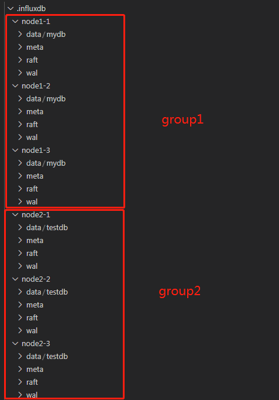

## InfluxDB

#### 1. [https://gitee.com/l-iberty/influxdb](https://gitee.com/l-iberty/influxdb)

3个分支：

- `b1.8.3` (默认分支)
	最早开始做的存储引擎改造：乱序表、层间拷贝、消除compaction带来的写停顿。后面又将 L2 TSM 发送到 storage pool 的存储节点上。
- `b1.8.3_p1_no_writestall`
	这是从默认分支上剥离出来的，只包括存储引擎改造部分。
- `b1.8.3_p2_btreeindex`
	在`b1.8.3_p1_no_writestall`基础上的改造。在与华为初期的讨论中我了解到高基数问题，进行了相关调研后我把 series index 的实现由 hashmap 改为 btree，实验证明这并不能带来性能提升。

#### 2. [https://gitee.com/l-iberty/distributed-influxdb](https://gitee.com/l-iberty/distributed-influxdb) `v1.8.2_distributed`分支(默认)

参考[https://github.com/jasonjoo2010/chronus](https://github.com/jasonjoo2010/chronus)和[https://github.com/angopher/chronus](https://github.com/angopher/chronus)在 v1.8.2 基础上进行的分布式改造，meta nodes 使用 raft 实现强一致性，data nodes 使用 influxdb 官方集群方案。

#### 3. [https://gitee.com/l-iberty/distributed-influxdb2](https://gitee.com/l-iberty/distributed-influxdb2) `v1.8.2_distributed`分支(默认)

在[distributed-influxdb](https://gitee.com/l-iberty/distributed-influxdb)的基础上，把之前对存储引擎的改造，以及发送 L2 TSM 到 storage pool 的代码迁移过来。

#### 4. [https://gitee.com/l-iberty/distributed-influxdb3](https://gitee.com/l-iberty/distributed-influxdb3) `master`分支(默认)

在[distribuetd-influxdb2](https://gitee.com/l-iberty/distributed-influxdb2)基础上，采用 raft 实现 data nodes 的强一致性（只实现了写操作的强一致性保证，读操作直接按照 influxdb 原有的单机版逻辑在本地读取，未实现线性一致性读）。此外我还在[distributed-influxdb2](https://gitee.com/l-iberty/distributed-influxdb2)的分布式方案基础上进行了裁剪，删除了很多我不关心的功能模块。

对于这个版本我没有写详细的文档，具体的代码修改可以从 commit 记录里看到。关键点：

- 在`services.http.Handler`上绑定一个`raftmeta.RaftNode`和`raftmeta.DataService`
- 在`RaftNode`上绑定一个`coordinator.PointsWriter`, apply committed log 的时候利用它完成写操作
- `services.http.(*Handler).serveWrite`不再直接调用`(*coordinator.PointsWriter).WritePoints`，而是调用`(*raftmeta.DataServices).ProposeAndWait`把写请求打到 raft 层
- 尚未实现线性一致性读，直接从本地读，不走 raft 流程

## Influx-Proxy

[https://github.com/l-iberty/influx-proxy](https://github.com/l-iberty/influx-proxy)

参考：[InfluxDB集群化方案之influx-proxy的说明](https://sun-iot.gitee.io/posts/2755494b)

每个 circle 存储一份全量数据，所以为了实现“分库分表”，也就是根据 db 和 measurement 把数据打到不同的 influxdb raft group，需要把多个 group 里的 influxdb 实例全部配置在一个 circle 里面。

存在的问题：influx-proxy 在把接收到的有序数据转发给 influxdb 实例时，会产生少量的紊乱。如果 influx-proxy 连接到我们改造后的 influxdb 上就会发生少量乱序数据被丢弃的现象。

## Storage Pool

1. 用 etcd 搭建的 master 集群：[https://github.com/l-iberty/etcd/tree/v3.4.9/contrib/raftexample](https://github.com/l-iberty/etcd/tree/v3.4.9/contrib/raftexample)

2. slaves 节点：[https://github.com/l-iberty/slave](https://github.com/l-iberty/slave)

## 部署
在未引入 influx-proxy 时使用的本地的3台虚拟机，仅支持一个3副本的 influxdb raft 集群。引入 influx-proxy 后机器性能会变得非常不稳定，时常因为 out of memory 而崩溃。

为了在较稳定的环境下测试，我把上面的全部组件打包到了实验室的主机上运行。配置如下：


其他详细信息见配置文件。

## 简单的读写测试
测试程序和数据：[https://github.com/taosdata/TDengine/tree/develop/tests/comparisonTest](https://github.com/taosdata/TDengine/tree/develop/tests/comparisonTest)

我把这部分代码单独放在这里[https://github.com/l-iberty/influxdb-test](https://github.com/l-iberty/influxdb-test)。这里面还有我的一些修改，例如流式查询，以及与分布式有关的参数设置：

在对[distributed-influxdb](https://gitee.com/l-iberty/distributed-influxdb)和 [distributed-influxdb2](https://gitee.com/l-iberty/distributed-influxdb2)进行测试时，如果要保证3个 data nodes 每个都存储全量数据（默认每个节点只存储一部分数据），需要将`consistency`设置成`all`、将`replicaN`设置成3。

#### 1. 少量数据的写入

将 10,000,000 条记录分别写入`mydb`和`testdb`两个数据库

测试程序将写请求打到 influx-proxy：

```
➜  influxdb ./write.sh
2021/11/24 20:27:01 write data
2021/11/24 20:27:01 ---- writeClients: 8
2021/11/24 20:27:01 ---- dataDir: ../testdata_100M
2021/11/24 20:27:01 ---- numOfFiles: 10
2021/11/24 20:27:01 ---- rowsPerRequest: 1000
2021/11/24 20:27:01 ---- replicaN: 1
2021/11/24 20:27:01 ---- writeConsistency:
......
2021/11/24 20:28:41 ---- Spent 99.600205063 seconds to insert 10000000 records, speed: 100401.39971272861 Rows/Second
➜  influxdb vi write.sh
➜  influxdb ./write.sh
2021/11/24 20:29:24 write data
2021/11/24 20:29:24 ---- writeClients: 8
2021/11/24 20:29:24 ---- dataDir: ../testdata_100M
2021/11/24 20:29:24 ---- numOfFiles: 10
2021/11/24 20:29:24 ---- rowsPerRequest: 1000
2021/11/24 20:29:24 ---- replicaN: 1
2021/11/24 20:29:24 ---- writeConsistency:
......
2021/11/24 20:31:01 ---- Spent 97.391830066 seconds to insert 10000000 records, speed: 102678.01717272641 Rows/Second
```

L1 TSM 数据分布：



在 influx-proxy 上发起查询：

```
➜  influx ./influx -port 7076
Connected to http://localhost:7076 version not build
InfluxDB shell version: unknown
> show databases
name: databases
name
----
testdb
mydb
> SELECT COUNT(*) FROM mydb.autogen.devices
name: devices
time count_humidity count_temperature
---- -------------- -----------------
0    10000000       10000000
>
> SELECT COUNT(*) FROM testdb.autogen.devices
name: devices
time count_humidity count_temperature
---- -------------- -----------------
0    10000000       10000000
```

可以看到，因为数据量较小，所以系统运行得很平稳，尚未产生乱序数据被丢弃的现象。

#### 2. 大量数据的写入

将 50,000,000 条记录分别写入`mydb`和`testdb`两个数据库

测试程序将写请求打到 influx-proxy：

```
➜  influxdb ./write.sh
2021/11/25 09:31:11 write data
2021/11/25 09:31:11 ---- writeClients: 4
2021/11/25 09:31:11 ---- dataDir: ../testdata_100M
2021/11/25 09:31:11 ---- numOfFiles: 50
2021/11/25 09:31:11 ---- rowsPerRequest: 1000
2021/11/25 09:31:11 ---- replicaN: 1
2021/11/25 09:31:11 ---- writeConsistency:
......
2021/11/25 09:38:42 ---- Spent 450.969409402 seconds to insert 50000000 records, speed: 110872.26529688924 Rows/Second
```

```
➜  influxdb ./write.sh
2021/11/25 09:51:02 write data
2021/11/25 09:51:02 ---- writeClients: 4
2021/11/25 09:51:02 ---- dataDir: ../testdata_100M
2021/11/25 09:51:02 ---- numOfFiles: 50
2021/11/25 09:51:02 ---- rowsPerRequest: 1000
2021/11/25 09:51:02 ---- replicaN: 1
2021/11/25 09:51:02 ---- writeConsistency:
......
2021/11/25 09:59:57 ---- Spent 534.824684362 seconds to insert 50000000 records, speed: 93488.57945785677 Rows/Second
```

L1 TSM 分布同前，L2 TSM 分布如下：


L2 TSM 同时被备份到 storage pool 的 6 个 slave 节点上：


在 influx-proxy 上发起查询：

```
➜  influx ./influx -port 7076
Connected to http://localhost:7076 version not build
InfluxDB shell version: unknown
> show databases
name: databases
name
----
mydb
testdb
> SELECT COUNT(*) FROM mydb.autogen.devices
name: devices
time count_humidity count_temperature
---- -------------- -----------------
0    49982342       49982342
>
> SELECT COUNT(*) FROM testdb.autogen.devices
name: devices
time count_humidity count_temperature
---- -------------- -----------------
0    49994244       49994244
```

可以看到，由于数据量的增大，influx-proxy 在将数据转发给 influxdb 实例的时候发生了紊乱，产生了少量乱序数据被丢弃的现象。为了进行对比，我们再进行一个实验，将对`mydb`和`testdb`写请求直接打到 influxdb 实例上：

```
➜  influxdb ./write.sh
2021/11/25 10:25:09 write data
2021/11/25 10:25:09 ---- writeClients: 4
2021/11/25 10:25:09 ---- dataDir: ../testdata_100M
2021/11/25 10:25:09 ---- numOfFiles: 50
2021/11/25 10:25:09 ---- rowsPerRequest: 1000
2021/11/25 10:25:09 ---- replicaN: 1
2021/11/25 10:25:09 ---- writeConsistency:
2021/11/25 10:25:09 Thread 4 writing sID 38 eID 49
2021/11/25 10:25:09 Thread 1 writing sID 0 eID 12
2021/11/25 10:25:09 Thread 2 writing sID 13 eID 25
2021/11/25 10:25:09 Thread 3 writing sID 26 eID 37
......
2021/11/25 10:51:59 ---- Spent 1610.122675246 seconds to insert 50000000 records, speed: 31053.534472061783 Rows/Second
```

```
➜  influxdb ./write.sh
2021/11/25 11:02:00 write data
2021/11/25 11:02:00 ---- writeClients: 4
2021/11/25 11:02:00 ---- dataDir: ../testdata_100M
2021/11/25 11:02:00 ---- numOfFiles: 50
2021/11/25 11:02:00 ---- rowsPerRequest: 1000
2021/11/25 11:02:00 ---- replicaN: 1
2021/11/25 11:02:00 ---- writeConsistency:
......
2021/11/25 11:28:27 ---- Spent 1587.023246435 seconds to insert 50000000 records, speed: 31505.524643269844 Rows/Second
```

有意思的是，把写请求打到 influx-proxy 上时，客户端表现出来的吞吐量尽然比直接打到 influxdb 实例上快了3～4倍！在少量数据（10,000,000条记录）的写入测试中也是如此。经过测试分析发现，造成这种差异的原因在于 influx-proxy 的两个优化：配置中的`flush_size`(默认10000)和`conn_pool_size`(默认20)两个选项，如果把`flush_size`设置成与客户端批量写的 data points 数量一致(也就是1000)，`conn_pool_size`设置成1，那么 influx-proxy 表现给客户端的吞吐量就和请求直接打到 influxdb 实例上一致了。

下面是 L2 TSM 在 slave 节点上的分布：

.png)

客户端分别连接到两个 raft group 里的 influxdb 实例上进行查询：

```
➜  influx ./influx -port 8088
Connected to http://localhost:8088 version unknown
InfluxDB shell version: unknown
>
> SELECT COUNT(*) FROM mydb.autogen.devices
name: devices
time count_humidity count_temperature
---- -------------- -----------------
0    50000000       50000000
```

```
➜  influx ./influx -port 18088
Connected to http://localhost:18088 version unknown
InfluxDB shell version: unknown
>
> SELECT COUNT(*) FROM testdb.autogen.devices
name: devices
time count_humidity count_temperature
---- -------------- -----------------
0    50000000       50000000
```

由于写请求直接打到 influxdb 实例上，没有经过 influx-proxy，所以未出现乱序。

data nodes 有时会报一个异常，来自`(*ClusterMetaClient).syncLoop`同步元数据的操作：`index X < local index Y`。这个异常无关紧要，但我想出现这个异常的时候是否需要设置`needSync = true`？异常的本质是本地数据可能比 meta nodes 更新，所以是否需要把本地数据退回和 meta nodes 一致的版本？