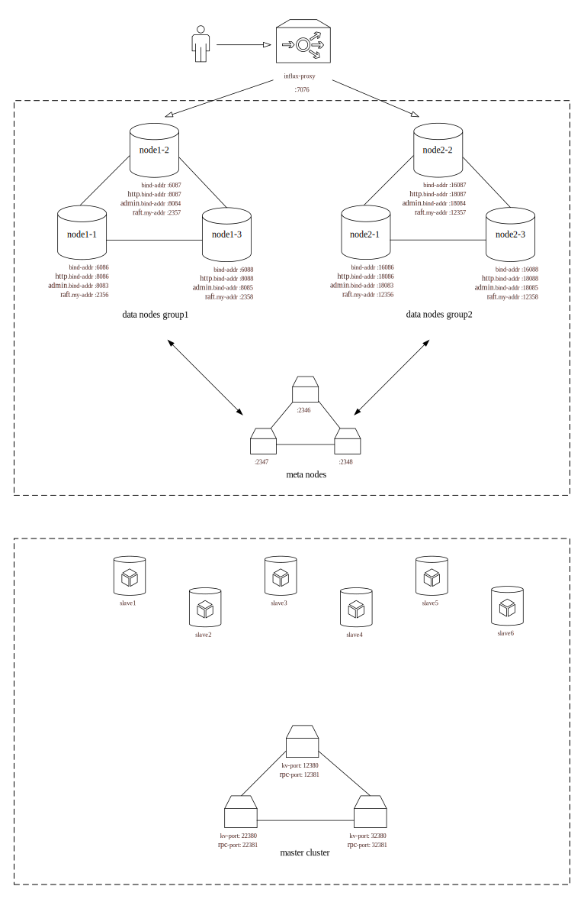

## InfluxDB

#### 1. [https://gitee.com/l-iberty/influxdb](https://gitee.com/l-iberty/influxdb)

3个分支：

- `b1.8.3` (默认分支)
	最早开始做的存储引擎改造：乱序表、层间拷贝、消除compaction带来的写停顿。后面又将 L2 TSM 发送到 storage pool 的存储节点上。
- `b1.8.3_p1_no_writestall`
	这是从默认分支上剥离出来的，只包括存储引擎改造部分。**论文中“单机存储引擎的性能测试”就是以这部分代码进行的**。后期我进行了优化，利用`sync.Map`实现`seriesKey2Min/MaxTime`，也只是做在了这个分支上。
- `b1.8.3_p2_btreeindex`
	在`b1.8.3_p1_no_writestall`基础上的改造。在与华为初期的讨论中我了解到高基数问题，进行了相关调研后我把 series index 的实现由 hashmap 改为 btree，实验证明这并不能带来性能提升。

#### 2. [https://gitee.com/l-iberty/distributed-influxdb](https://gitee.com/l-iberty/distributed-influxdb) `v1.8.2_distributed`分支(默认)

参考[https://github.com/jasonjoo2010/chronus](https://github.com/jasonjoo2010/chronus)和[https://github.com/angopher/chronus](https://github.com/angopher/chronus)在 v1.8.2 基础上进行的分布式改造，meta nodes 使用 raft 实现强一致性，data nodes 使用 influxdb 官方集群方案。

#### 3. [https://gitee.com/l-iberty/distributed-influxdb2](https://gitee.com/l-iberty/distributed-influxdb2) `v1.8.2_distributed`分支(默认)

在[distributed-influxdb](https://gitee.com/l-iberty/distributed-influxdb)的基础上，把之前对存储引擎的改造，以及发送 L2 TSM 到 storage pool 的代码迁移过来。

#### 4. [https://gitee.com/l-iberty/distributed-influxdb3](https://gitee.com/l-iberty/distributed-influxdb3) `master`分支(默认)

**这是最终用在整个分布式系统里的版本**。

在[distribuetd-influxdb2](https://gitee.com/l-iberty/distributed-influxdb2)基础上，采用 raft 实现 data nodes 的强一致性（只实现了写操作的强一致性保证，读操作不走 raft 流程）。读操作分为本地读取和远端读取(“远端”指的是 storage pool 里的镜像)，实现时参考了[distributed-influxdb](https://gitee.com/l-iberty/distributed-influxdb)的方案。

此外我还在[distributed-influxdb2](https://gitee.com/l-iberty/distributed-influxdb2)基础上进行了裁剪，删除了很多我不关心的功能模块。

#### 5. [https://gitee.com/l-iberty/influxdb-storage-mirror](https://gitee.com/l-iberty/influxdb-storage-mirror) `v1.8.2_storage_mirror`分支(默认)

位于 storage pool 的镜像节点，用于存储 L2 TSM。镜像节点上开启远程查询服务供上层 data nodes 调用。这部分代码同样参考了[distributed-influxdb](https://gitee.com/l-iberty/distributed-influxdb)。

## Influx-Proxy

[https://github.com/l-iberty/influx-proxy](https://github.com/l-iberty/influx-proxy)

参考：[InfluxDB集群化方案之influx-proxy的说明](https://sun-iot.gitee.io/posts/2755494b)

**我对 influx-proxy 进行了修改，使其满足我的需求，详见论文**。

存在的问题：influx-proxy 在把接收到的有序数据转发给 influxdb 实例时，会产生少量的紊乱。如果 influx-proxy 连接到我们改造后的 influxdb 上就会发生少量乱序数据被丢弃的现象。

配置选项中的`flush_size`(默认10000)和`conn_pool_size`(默认20)直接关系到 InfluxDB 表现给客户端的吞吐量。

## Storage Pool

1. 用 etcd 搭建的 master 集群：[https://github.com/l-iberty/etcd/tree/v3.4.9/contrib/raftexample](https://github.com/l-iberty/etcd/tree/v3.4.9/contrib/raftexample)

2. slaves 节点：[https://github.com/l-iberty/slave](https://github.com/l-iberty/slave)

3. InfluxDB 镜像：[https://gitee.com/l-iberty/influxdb-storage-mirror](https://gitee.com/l-iberty/influxdb-storage-mirror)

## 部署

(这是早期绘制的一个草图，测试时可按需添加 StoreNode )

在未引入 influx-proxy 时使用的本地的3台虚拟机，仅支持一个3副本的 influxdb raft 集群。引入 influx-proxy 后机器性能会变得非常不稳定，时常因为 out of memory 而崩溃。

为了在较稳定的环境下测试，我把上面的全部组件打包到了实验室的主机上运行。配置如下：



其他详细信息见配置文件。

## 测试
测试程序和数据：[https://github.com/taosdata/TDengine/tree/develop/tests/comparisonTest](https://github.com/taosdata/TDengine/tree/develop/tests/comparisonTest)

我把这部分代码单独放在这里[https://github.com/l-iberty/influxdb-test](https://github.com/l-iberty/influxdb-test)。这里面还有我的一些修改，例如流式查询，以及与分布式有关的参数设置：

在对[distributed-influxdb](https://gitee.com/l-iberty/distributed-influxdb)和 [distributed-influxdb2](https://gitee.com/l-iberty/distributed-influxdb2)进行测试时，如果要保证3个 data nodes 每个都存储全量数据（默认每个节点只存储一部分数据），需要将`consistency`设置成`all`、将`replicaN`设置成3。

完整的测试包：[https://gitee.com/l-iberty/distributed_influxdb_test_pkg](https://gitee.com/l-iberty/distributed_influxdb_test_pkg)

### Testcase 1: 5000万条记录，无任何节点宕机

参数设置：

```
# test arguments
top=$(pwd)
dbs=(mydb testdb)
measurement=devices
numMetaNodes=3
numGroups=2
numPeersPerGroup=3
numMasters=3
masterCluster="http://127.0.0.1:12379,http://127.0.0.1:22379,http://127.0.0.1:32379"
masterPorts=(12380 22380 32380)
numSlaves=9
numCrashSlaves=0
slavePIDs=()
influxdPIDs=()
slaveHosts=("127.0.0.1" "127.0.0.1" "127.0.0.1" "127.0.0.1" "127.0.0.1" "127.0.0.1" "127.0.0.1" "127.0.0.1" "127.0.0.1")
slavePorts=(7890 7891 7892 7893 7894 7895 7896 7897 7898)
slaveCmdPorts=(7880 7881 7882 7883 7884 7885 7886 7887 7888)
writeClients=8
testdataDir="${top}/test/testdata_100M"
numOfFiles=50
rowsPerRequest=1000
serverHost="http://localhost:7076"
rowsPerFile=1000000
numPoints=$((numOfFiles * rowsPerFile))
```

这里使用了9个 StoreNode，所以会有3个冗余备份。

```
➜  pkg git:(master) ✗ ./test.sh

*** starting meta nodes
   meta node 1: 491
   meta node 2: 557
   meta node 3: 598

*** starting data nodes
   data node 1-1: 763
   data node 1-2: 817
   data node 1-3: 874
   data node 2-1: 1023
   data node 2-2: 1082
   data node 2-3: 1149

*** starting proxy
   proxy: 1209

*** starting masters
   master 1: 1228
   master 2: 1229
   master 3: 1230

*** starting slaves
   slave 1: 1291
   slave 2: 1293
   slave 3: 1302
   slave 4: 1312
   slave 5: 1324
   slave 6: 1328
   slave 7: 1339
   slave 8: 1344
   slave 9: 1351

*** starting influxdb mirrors
   influxdb mirror 1: 1432
   influxdb mirror 2: 1433
   influxdb mirror 3: 1434
   influxdb mirror 4: 1435
   influxdb mirror 5: 1436
   influxdb mirror 6: 1437
   influxdb mirror 7: 1438
   influxdb mirror 8: 1439
   influxdb mirror 9: 1440

*** starting write test
=== writing to mydb
2021/12/27 09:29:02 write data
2021/12/27 09:29:02 ---- writeClients: 8
2021/12/27 09:29:02 ---- dataDir: /home/zhuxx/pkg/test/testdata_100M
2021/12/27 09:29:02 ---- numOfFiles: 50
2021/12/27 09:29:02 ---- rowsPerRequest: 1000
2021/12/27 09:29:02 ---- replicaN: 1
2021/12/27 09:29:02 ---- writeConsistency:
2021/12/27 09:29:02 Thread 8 writing sID 44 eID 49
2021/12/27 09:29:02 Thread 3 writing sID 14 eID 19
2021/12/27 09:29:02 Thread 1 writing sID 0 eID 6
2021/12/27 09:29:02 Thread 2 writing sID 7 eID 13
2021/12/27 09:29:02 Thread 6 writing sID 32 eID 37
2021/12/27 09:29:02 Thread 4 writing sID 20 eID 25
2021/12/27 09:29:02 Thread 5 writing sID 26 eID 31
2021/12/27 09:29:02 Thread 7 writing sID 38 eID 43
2021/12/27 09:29:02 open file /home/zhuxx/pkg/test/testdata_100M/testdata7.csv success
2021/12/27 09:29:02 open file /home/zhuxx/pkg/test/testdata_100M/testdata38.csv success
......
2021/12/27 10:26:11 open file /home/zhuxx/pkg/test/testdata_100M/testdata13.csv success
2021/12/27 10:28:30 ---- Spent 3568.626834053 seconds to insert 50000000 records, speed: 14010.991433142774 Rows/Second
=== writing to testdb
2021/12/27 10:28:30 write data
2021/12/27 10:28:30 ---- writeClients: 8
2021/12/27 10:28:30 ---- dataDir: /home/zhuxx/pkg/test/testdata_100M
2021/12/27 10:28:30 ---- numOfFiles: 50
2021/12/27 10:28:30 ---- rowsPerRequest: 1000
2021/12/27 10:28:30 ---- replicaN: 1
2021/12/27 10:28:30 ---- writeConsistency:
2021/12/27 10:28:30 Thread 8 writing sID 44 eID 49
2021/12/27 10:28:30 Thread 2 writing sID 7 eID 13
2021/12/27 10:28:30 Thread 5 writing sID 26 eID 31
2021/12/27 10:28:30 Thread 1 writing sID 0 eID 6
2021/12/27 10:28:30 Thread 6 writing sID 32 eID 37
2021/12/27 10:28:30 Thread 4 writing sID 20 eID 25
2021/12/27 10:28:30 Thread 3 writing sID 14 eID 19
2021/12/27 10:28:30 Thread 7 writing sID 38 eID 43
2021/12/27 10:28:31 open file /home/zhuxx/pkg/test/testdata_100M/testdata44.csv success
2021/12/27 10:28:31 open file /home/zhuxx/pkg/test/testdata_100M/testdata26.csv success
......
2021/12/27 11:29:12 open file /home/zhuxx/pkg/test/testdata_100M/testdata13.csv success
2021/12/27 11:31:38 ---- Spent 3788.186796218 seconds to insert 50000000 records, speed: 13198.92673981081 Rows/Second

*** starting query test
=== query from mydb
  % Total    % Received % Xferd  Average Speed   Time    Time     Time  Current
                                 Dload  Upload   Total   Spent    Left  Speed
100   173  100   173    0     0    125      0  0:00:01  0:00:01 --:--:--   125
{"results":[{"statement_id":0,"series":[{"name":"devices","columns":["time","count_humidity","count_temperature"],"values":[["1970-01-01T00:00:00Z",50000000,50000000]]}]}]}
=== PASS

=== query from testdb
  % Total    % Received % Xferd  Average Speed   Time    Time     Time  Current
                                 Dload  Upload   Total   Spent    Left  Speed
100   173  100   173    0     0    310      0 --:--:-- --:--:-- --:--:--   310
{"results":[{"statement_id":0,"series":[{"name":"devices","columns":["time","count_humidity","count_temperature"],"values":[["1970-01-01T00:00:00Z",50000000,50000000]]}]}]}
=== PASS
```

### Testcase 2: 5000万条记录，4 个 StoreNode 宕机

参数设置：

```
# test arguments
top=$(pwd)
dbs=(mydb testdb)
measurement=devices
numMetaNodes=3
numGroups=2
numPeersPerGroup=3
numMasters=3
masterCluster="http://127.0.0.1:12379,http://127.0.0.1:22379,http://127.0.0.1:32379"
masterPorts=(12380 22380 32380)
numSlaves=12
numCrashSlaves=4
slavePIDs=()
influxdPIDs=()
slaveHosts=("127.0.0.1" "127.0.0.1" "127.0.0.1" "127.0.0.1" "127.0.0.1" "127.0.0.1" "127.0.0.1" "127.0.0.1" "127.0.0.1" "127.0.0.1" "127.0.0.1" "127.0.0.1")
slavePorts=(7890 7891 7892 7893 7894 7895 7896 7897 7898 9000 9001 9002)
slaveCmdPorts=(7880 7881 7882 7883 7884 7885 7886 7887 7888 9010 9011 9012)
writeClients=8
testdataDir="${top}/test/testdata_100M"
numOfFiles=50
rowsPerRequest=1000
serverHost="http://localhost:7076"
rowsPerFile=1000000
numPoints=$((numOfFiles * rowsPerFile))
```

```
➜  pkg git:(master) ✗ ./test.sh
*** starting meta nodes
   meta node 1: 272992
   meta node 2: 273151
   meta node 3: 273197

*** starting data nodes
   data node 1-1: 273256
   data node 1-2: 273383
   data node 1-3: 273440
   data node 2-1: 273506
   data node 2-2: 273562
   data node 2-3: 273711

*** starting proxy
   proxy: 273823

*** starting masters
   master 1: 273827
   master 2: 273828
   master 3: 273829

*** starting slaves
   slave 1: 273933
   slave 2: 273935
   slave 3: 273937
   slave 4: 273949
   slave 5: 273956
   slave 6: 273963
   slave 7: 273970
   slave 8: 273984
   slave 9: 273991
   slave 10: 273999
   slave 11: 274008
   slave 12: 274016

*** starting influxdb mirrors
   influxdb mirror 1: 274032
   influxdb mirror 2: 274033
   influxdb mirror 3: 274034
   influxdb mirror 4: 274035
   influxdb mirror 5: 274036
   influxdb mirror 6: 274037
   influxdb mirror 7: 274038
   influxdb mirror 8: 274039
   influxdb mirror 9: 274040
   influxdb mirror 10: 274041
   influxdb mirror 11: 274042
   influxdb mirror 12: 274044

*** starting write test
=== writing to mydb
2021/12/29 22:12:26 write data
2021/12/29 22:12:26 ---- writeClients: 8
2021/12/29 22:12:26 ---- dataDir: /home/zhuxx/pkg/test/testdata_100M
2021/12/29 22:12:26 ---- numOfFiles: 50
2021/12/29 22:12:26 ---- rowsPerRequest: 1000
2021/12/29 22:12:26 ---- replicaN: 1
2021/12/29 22:12:26 ---- writeConsistency:
2021/12/29 22:12:26 Thread 8 writing sID 44 eID 49
2021/12/29 22:12:26 Thread 2 writing sID 7 eID 13
2021/12/29 22:12:26 Thread 5 writing sID 26 eID 31
2021/12/29 22:12:26 Thread 3 writing sID 14 eID 19
2021/12/29 22:12:26 Thread 1 writing sID 0 eID 6
2021/12/29 22:12:26 Thread 6 writing sID 32 eID 37
2021/12/29 22:12:26 Thread 4 writing sID 20 eID 25
2021/12/29 22:12:26 Thread 7 writing sID 38 eID 43
2021/12/29 22:12:27 open file /home/zhuxx/pkg/test/testdata_100M/testdata44.csv success
2021/12/29 22:12:27 open file /home/zhuxx/pkg/test/testdata_100M/testdata14.csv success
......
2021/12/29 23:12:52 open file /home/zhuxx/pkg/test/testdata_100M/testdata13.csv success
2021/12/29 23:15:15 ---- Spent 3768.754741349 seconds to insert 50000000 records, speed: 13266.981650841743 Rows/Second
=== writing to testdb
2021/12/29 23:15:15 write data
2021/12/29 23:15:15 ---- writeClients: 8
2021/12/29 23:15:15 ---- dataDir: /home/zhuxx/pkg/test/testdata_100M
2021/12/29 23:15:15 ---- numOfFiles: 50
2021/12/29 23:15:15 ---- rowsPerRequest: 1000
2021/12/29 23:15:15 ---- replicaN: 1
2021/12/29 23:15:15 ---- writeConsistency:
2021/12/29 23:15:15 Thread 8 writing sID 44 eID 49
2021/12/29 23:15:15 Thread 1 writing sID 0 eID 6
2021/12/29 23:15:15 Thread 4 writing sID 20 eID 25
2021/12/29 23:15:15 Thread 2 writing sID 7 eID 13
2021/12/29 23:15:15 Thread 6 writing sID 32 eID 37
2021/12/29 23:15:15 Thread 5 writing sID 26 eID 31
2021/12/29 23:15:15 Thread 7 writing sID 38 eID 43
2021/12/29 23:15:15 Thread 3 writing sID 14 eID 19
2021/12/29 23:15:16 open file /home/zhuxx/pkg/test/testdata_100M/testdata26.csv success
2021/12/29 23:15:16 open file /home/zhuxx/pkg/test/testdata_100M/testdata38.csv success
......
2021/12/30 00:19:39 open file /home/zhuxx/pkg/test/testdata_100M/testdata13.csv success
2021/12/30 00:22:06 ---- Spent 4011.289539865 seconds to insert 50000000 records, speed: 12464.819480890115 Rows/Second

*** starting query test
killing slave 4: 273949
killing influxd 4: 274035
   waiting for /home/zhuxx/pkg/storage/slave/slave12/data to be removed
   waiting for /home/zhuxx/pkg/storage/slave/slave12/data to be removed
   ......
   waiting for /home/zhuxx/pkg/storage/slave/slave12/data to be removed
killing slave 7: 273970
killing influxd 7: 274038
   waiting for /home/zhuxx/pkg/storage/slave/slave3/data to be removed
   waiting for /home/zhuxx/pkg/storage/slave/slave3/data to be removed
   ......
   waiting for /home/zhuxx/pkg/storage/slave/slave3/data to be removed
killing slave 8: 273984
killing influxd 8: 274039
   waiting for /home/zhuxx/pkg/storage/slave/slave2/data to be removed
   waiting for /home/zhuxx/pkg/storage/slave/slave2/data to be removed
   ......
   waiting for /home/zhuxx/pkg/storage/slave/slave2/data to be removed
   waiting for /home/zhuxx/pkg/storage/slave/slave2/data to be removed
killing slave 5: 273956
killing influxd 5: 274036
   waiting for /home/zhuxx/pkg/storage/slave/slave11/data to be removed
   waiting for /home/zhuxx/pkg/storage/slave/slave11/data to be removed
   ......
   waiting for /home/zhuxx/pkg/storage/slave/slave11/data to be removed
=== query from mydb
  % Total    % Received % Xferd  Average Speed   Time    Time     Time  Current
                                 Dload  Upload   Total   Spent    Left  Speed
100   173  100   173    0     0    225      0 --:--:-- --:--:-- --:--:--   225
{"results":[{"statement_id":0,"series":[{"name":"devices","columns":["time","count_humidity","count_temperature"],"values":[["1970-01-01T00:00:00Z",50000000,50000000]]}]}]}
=== PASS

=== query from testdb
  % Total    % Received % Xferd  Average Speed   Time    Time     Time  Current
                                 Dload  Upload   Total   Spent    Left  Speed
100   173  100   173    0     0    309      0 --:--:-- --:--:-- --:--:--   309
{"results":[{"statement_id":0,"series":[{"name":"devices","columns":["time","count_humidity","count_temperature"],"values":[["1970-01-01T00:00:00Z",49999746,49999746]]}]}]}
=== WARNING: points got 49999746, expected 50000000

./test.sh: line 7: kill: (273949) - No such process
./test.sh: line 7: kill: (273956) - No such process
./test.sh: line 7: kill: (273970) - No such process
./test.sh: line 7: kill: (273984) - No such process
./test.sh: line 7: kill: (274035) - No such process
./test.sh: line 7: kill: (274036) - No such process
./test.sh: line 7: kill: (274038) - No such process
./test.sh: line 7: kill: (274039) - No such process
```

**一个小问题**：data nodes 有时会报一个异常，来自`(*ClusterMetaClient).syncLoop`同步元数据的操作：`index X < local index Y`。这个异常无关紧要，但我想出现这个异常的时候是否需要设置`needSync = true`？异常的本质是本地数据可能比 meta nodes 更新，所以是否需要把本地数据退回和 meta nodes 一致的版本？

### Testcase 3: 5000万条记录，6 个 StoreNode 宕机

参数设置：

```
# test arguments
top=$(pwd)
dbs=(mydb testdb)
measurement=devices
numMetaNodes=3
numGroups=2
numPeersPerGroup=3
numMasters=3
masterCluster="http://127.0.0.1:12379,http://127.0.0.1:22379,http://127.0.0.1:32379"
masterPorts=(12380 22380 32380)
numSlaves=12
numCrashSlaves=6
slavePIDs=()
influxdPIDs=()
slaveHosts=("127.0.0.1" "127.0.0.1" "127.0.0.1" "127.0.0.1" "127.0.0.1" "127.0.0.1" "127.0.0.1" "127.0.0.1" "127.0.0.1" "127.0.0.1" "127.0.0.1" "127.0.0.1")
slavePorts=(7890 7891 7892 7893 7894 7895 7896 7897 7898 9000 9001 9002)
slaveCmdPorts=(7880 7881 7882 7883 7884 7885 7886 7887 7888 9010 9011 9012)
writeClients=8
testdataDir="${top}/test/testdata_100M"
numOfFiles=50
rowsPerRequest=1000
serverHost="http://localhost:7076"
rowsPerFile=1000000
numPoints=$((numOfFiles * rowsPerFile))
```

```
➜  pkg git:(master) ✗ ./test.sh

*** starting meta nodes
   meta node 1: 839701
   meta node 2: 839722
   meta node 3: 839803

*** starting data nodes
   data node 1-1: 839833
   data node 1-2: 839866
   data node 1-3: 839962
   data node 2-1: 839991
   data node 2-2: 840023
   data node 2-3: 840117

*** starting proxy
   proxy: 840151

*** starting masters
   master 1: 840167
   master 2: 840168
   master 3: 840169

*** starting slaves
   slave 1: 840230
   slave 2: 840232
   slave 3: 840239
   slave 4: 840249
   slave 5: 840257
   slave 6: 840269
   slave 7: 840273
   slave 8: 840281
   slave 9: 840290
   slave 10: 840297
   slave 11: 840304
   slave 12: 840314

*** starting influxdb mirrors
   influxdb mirror 1: 840329
   influxdb mirror 2: 840330
   influxdb mirror 3: 840331
   influxdb mirror 4: 840332
   influxdb mirror 5: 840333
   influxdb mirror 6: 840334
   influxdb mirror 7: 840335
   influxdb mirror 8: 840336
   influxdb mirror 9: 840337
   influxdb mirror 10: 840338
   influxdb mirror 11: 840339
   influxdb mirror 12: 840340

*** starting write test
=== writing to mydb
2021/12/30 09:42:28 write data
2021/12/30 09:42:28 ---- writeClients: 8
2021/12/30 09:42:28 ---- dataDir: /home/zhuxx/pkg/test/testdata_100M
2021/12/30 09:42:28 ---- numOfFiles: 50
2021/12/30 09:42:28 ---- rowsPerRequest: 1000
2021/12/30 09:42:28 ---- replicaN: 1
2021/12/30 09:42:28 ---- writeConsistency:
2021/12/30 09:42:28 Thread 2 writing sID 7 eID 13
2021/12/30 09:42:28 Thread 4 writing sID 20 eID 25
2021/12/30 09:42:28 Thread 1 writing sID 0 eID 6
2021/12/30 09:42:28 Thread 8 writing sID 44 eID 49
2021/12/30 09:42:28 Thread 7 writing sID 38 eID 43
2021/12/30 09:42:28 Thread 6 writing sID 32 eID 37
2021/12/30 09:42:28 Thread 5 writing sID 26 eID 31
2021/12/30 09:42:28 Thread 3 writing sID 14 eID 19
2021/12/30 09:42:28 open file /home/zhuxx/pkg/test/testdata_100M/testdata20.csv success
2021/12/30 09:42:28 open file /home/zhuxx/pkg/test/testdata_100M/testdata32.csv success
......
2021/12/30 10:42:14 open file /home/zhuxx/pkg/test/testdata_100M/testdata13.csv success
2021/12/30 10:44:37 ---- Spent 3729.563450778 seconds to insert 50000000 records, speed: 13406.394785848146 Rows/Second
=== writing to testdb
2021/12/30 10:44:37 write data
2021/12/30 10:44:37 ---- writeClients: 8
2021/12/30 10:44:37 ---- dataDir: /home/zhuxx/pkg/test/testdata_100M
2021/12/30 10:44:37 ---- numOfFiles: 50
2021/12/30 10:44:37 ---- rowsPerRequest: 1000
2021/12/30 10:44:37 ---- replicaN: 1
2021/12/30 10:44:37 ---- writeConsistency:
2021/12/30 10:44:37 Thread 8 writing sID 44 eID 49
2021/12/30 10:44:37 Thread 4 writing sID 20 eID 25
2021/12/30 10:44:37 Thread 2 writing sID 7 eID 13
2021/12/30 10:44:37 Thread 3 writing sID 14 eID 19
2021/12/30 10:44:37 Thread 6 writing sID 32 eID 37
2021/12/30 10:44:37 Thread 1 writing sID 0 eID 6
2021/12/30 10:44:37 Thread 5 writing sID 26 eID 31
2021/12/30 10:44:37 Thread 7 writing sID 38 eID 43
2021/12/30 10:44:38 open file /home/zhuxx/pkg/test/testdata_100M/testdata0.csv success
2021/12/30 10:44:38 open file /home/zhuxx/pkg/test/testdata_100M/testdata14.csv success
......
2021/12/30 11:48:59 open file /home/zhuxx/pkg/test/testdata_100M/testdata13.csv success
2021/12/30 11:51:30 ---- Spent 4012.914660245 seconds to insert 50000000 records, speed: 12459.771570858014 Rows/Second

*** starting query test
killing slave 5: 840257
killing influxd 5: 840333
   waiting for /home/zhuxx/pkg/storage/slave/slave10/data to be removed
   waiting for /home/zhuxx/pkg/storage/slave/slave10/data to be removed
   ......
   waiting for /home/zhuxx/pkg/storage/slave/slave10/data to be removed
killing slave 8: 840281
killing influxd 8: 840336
   waiting for /home/zhuxx/pkg/storage/slave/slave9/data to be removed
   waiting for /home/zhuxx/pkg/storage/slave/slave9/data to be removed
   ......
   waiting for /home/zhuxx/pkg/storage/slave/slave9/data to be removed
killing slave 12: 840314
killing influxd 12: 840340
   waiting for /home/zhuxx/pkg/storage/slave/slave3/data to be removed
   waiting for /home/zhuxx/pkg/storage/slave/slave3/data to be removed
   ......
   waiting for /home/zhuxx/pkg/storage/slave/slave3/data to be removed
killing slave 4: 840249
killing influxd 4: 840332
   waiting for /home/zhuxx/pkg/storage/slave/slave11/data to be removed
   waiting for /home/zhuxx/pkg/storage/slave/slave11/data to be removed
   ......
   waiting for /home/zhuxx/pkg/storage/slave/slave11/data to be removed
killing slave 1: 840230
killing influxd 1: 840329
   waiting for /home/zhuxx/pkg/storage/slave/slave6/data to be removed
   waiting for /home/zhuxx/pkg/storage/slave/slave6/data to be removed
   ......
   waiting for /home/zhuxx/pkg/storage/slave/slave6/data to be removed
killing slave 2: 840232
killing influxd 2: 840330
   waiting for /home/zhuxx/pkg/storage/slave/slave7/data to be removed
   waiting for /home/zhuxx/pkg/storage/slave/slave7/data to be removed
   ......
   waiting for /home/zhuxx/pkg/storage/slave/slave7/data to be removed
=== query from mydb
  % Total    % Received % Xferd  Average Speed   Time    Time     Time  Current
                                 Dload  Upload   Total   Spent    Left  Speed
100   173  100   173    0     0    230      0 --:--:-- --:--:-- --:--:--   230
{"results":[{"statement_id":0,"series":[{"name":"devices","columns":["time","count_humidity","count_temperature"],"values":[["1970-01-01T00:00:00Z",50005328,50005328]]}]}]}
=== WARNING: points got 50005328, expected 50000000

=== query from testdb
  % Total    % Received % Xferd  Average Speed   Time    Time     Time  Current
                                 Dload  Upload   Total   Spent    Left  Speed
100   173  100   173    0     0    322      0 --:--:-- --:--:-- --:--:--   323
{"results":[{"statement_id":0,"series":[{"name":"devices","columns":["time","count_humidity","count_temperature"],"values":[["1970-01-01T00:00:00Z",49999130,49999130]]}]}]}
=== WARNING: points got 49999130, expected 50000000

./test.sh: line 7: kill: (840230) - No such process
./test.sh: line 7: kill: (840232) - No such process
./test.sh: line 7: kill: (840249) - No such process
./test.sh: line 7: kill: (840257) - No such process
./test.sh: line 7: kill: (840281) - No such process
./test.sh: line 7: kill: (840314) - No such process
./test.sh: line 7: kill: (840329) - No such process
./test.sh: line 7: kill: (840330) - No such process
./test.sh: line 7: kill: (840332) - No such process
./test.sh: line 7: kill: (840333) - No such process
./test.sh: line 7: kill: (840336) - No such process
./test.sh: line 7: kill: (840340) - No such process
```

查出来的数据比预期少是因为网络压力过大造成乱序数据被丢弃，但是比预期的多是为什么？

### Testcase 4: 1000万条记录，6 个 StoreNode 宕机

另外修改每个 data node 的配置：L1 TSM 满 1 个就刷到 L2

参数设置：
```
# test arguments
top=$(pwd)
dbs=(mydb testdb)
measurement=devices
numMetaNodes=3
numGroups=2
numPeersPerGroup=3
numMasters=3
masterCluster="http://127.0.0.1:12379,http://127.0.0.1:22379,http://127.0.0.1:32379"
masterPorts=(12380 22380 32380)
numSlaves=12
numCrashSlaves=6
slavePIDs=()
influxdPIDs=()
slaveHosts=("127.0.0.1" "127.0.0.1" "127.0.0.1" "127.0.0.1" "127.0.0.1" "127.0.0.1" "127.0.0.1" "127.0.0.1" "127.0.0.1" "127.0.0.1" "127.0.0.1" "127.0.0.1")
slavePorts=(7890 7891 7892 7893 7894 7895 7896 7897 7898 9000 9001 9002)
slaveCmdPorts=(7880 7881 7882 7883 7884 7885 7886 7887 7888 9010 9011 9012)
writeClients=8
testdataDir="${top}/test/testdata_100M"
numOfFiles=10
rowsPerRequest=1000
serverHost="http://localhost:7076"
rowsPerFile=1000000
numPoints=$((numOfFiles * rowsPerFile))
```

```
➜  pkg git:(master) ✗ ./test.sh

*** starting meta nodes
   meta node 1: 1047155
   meta node 2: 1047274
   meta node 3: 1047317

*** starting data nodes
   data node 1-1: 1047404
   data node 1-2: 1047521
   data node 1-3: 1047579
   data node 2-1: 1047637
   data node 2-2: 1047756
   data node 2-3: 1047884

*** starting proxy
   proxy: 1048019

*** starting masters
   master 1: 1048039
   master 2: 1048040
   master 3: 1048041

*** starting slaves
   slave 1: 1048116
   slave 2: 1048118
   slave 3: 1048120
   slave 4: 1048132
   slave 5: 1048141
   slave 6: 1048146
   slave 7: 1048153
   slave 8: 1048166
   slave 9: 1048175
   slave 10: 1048183
   slave 11: 1048191
   slave 12: 1048200

*** starting influxdb mirrors
   influxdb mirror 1: 1048221
   influxdb mirror 2: 1048222
   influxdb mirror 3: 1048223
   influxdb mirror 4: 1048224
   influxdb mirror 5: 1048225
   influxdb mirror 6: 1048226
   influxdb mirror 7: 1048227
   influxdb mirror 8: 1048228
   influxdb mirror 9: 1048229
   influxdb mirror 10: 1048230
   influxdb mirror 11: 1048231
   influxdb mirror 12: 1048232

*** starting write test
=== writing to mydb
2021/12/30 15:28:24 write data
2021/12/30 15:28:24 ---- writeClients: 8
2021/12/30 15:28:24 ---- dataDir: /home/zhuxx/pkg/test/testdata_100M
2021/12/30 15:28:24 ---- numOfFiles: 10
2021/12/30 15:28:24 ---- rowsPerRequest: 1000
2021/12/30 15:28:24 ---- replicaN: 1
2021/12/30 15:28:24 ---- writeConsistency:
2021/12/30 15:28:24 Thread 8 writing sID 9 eID 9
2021/12/30 15:28:24 Thread 1 writing sID 0 eID 1
2021/12/30 15:28:24 Thread 4 writing sID 5 eID 5
2021/12/30 15:28:24 Thread 6 writing sID 7 eID 7
2021/12/30 15:28:24 Thread 2 writing sID 2 eID 3
2021/12/30 15:28:24 Thread 7 writing sID 8 eID 8
2021/12/30 15:28:24 Thread 3 writing sID 4 eID 4
2021/12/30 15:28:24 Thread 5 writing sID 6 eID 6
2021/12/30 15:28:25 open file /home/zhuxx/pkg/test/testdata_100M/testdata0.csv success
2021/12/30 15:28:25 open file /home/zhuxx/pkg/test/testdata_100M/testdata4.csv success
2021/12/30 15:28:25 open file /home/zhuxx/pkg/test/testdata_100M/testdata8.csv success
2021/12/30 15:28:25 open file /home/zhuxx/pkg/test/testdata_100M/testdata2.csv success
2021/12/30 15:28:25 open file /home/zhuxx/pkg/test/testdata_100M/testdata6.csv success
2021/12/30 15:28:25 open file /home/zhuxx/pkg/test/testdata_100M/testdata7.csv success
2021/12/30 15:28:25 open file /home/zhuxx/pkg/test/testdata_100M/testdata9.csv success
2021/12/30 15:28:25 open file /home/zhuxx/pkg/test/testdata_100M/testdata5.csv success
2021/12/30 15:36:58 open file /home/zhuxx/pkg/test/testdata_100M/testdata1.csv success
2021/12/30 15:37:12 open file /home/zhuxx/pkg/test/testdata_100M/testdata3.csv success
2021/12/30 15:39:42 ---- Spent 677.385440154 seconds to insert 10000000 records, speed: 14762.643846797997 Rows/Second
=== writing to testdb
2021/12/30 15:39:42 write data
2021/12/30 15:39:42 ---- writeClients: 8
2021/12/30 15:39:42 ---- dataDir: /home/zhuxx/pkg/test/testdata_100M
2021/12/30 15:39:42 ---- numOfFiles: 10
2021/12/30 15:39:42 ---- rowsPerRequest: 1000
2021/12/30 15:39:42 ---- replicaN: 1
2021/12/30 15:39:42 ---- writeConsistency:
2021/12/30 15:39:42 Thread 8 writing sID 9 eID 9
2021/12/30 15:39:42 Thread 2 writing sID 2 eID 3
2021/12/30 15:39:42 Thread 5 writing sID 6 eID 6
2021/12/30 15:39:42 Thread 1 writing sID 0 eID 1
2021/12/30 15:39:42 Thread 6 writing sID 7 eID 7
2021/12/30 15:39:42 Thread 3 writing sID 4 eID 4
2021/12/30 15:39:42 Thread 7 writing sID 8 eID 8
2021/12/30 15:39:42 Thread 4 writing sID 5 eID 5
2021/12/30 15:39:42 open file /home/zhuxx/pkg/test/testdata_100M/testdata7.csv success
2021/12/30 15:39:42 open file /home/zhuxx/pkg/test/testdata_100M/testdata5.csv success
2021/12/30 15:39:42 open file /home/zhuxx/pkg/test/testdata_100M/testdata8.csv success
2021/12/30 15:39:42 open file /home/zhuxx/pkg/test/testdata_100M/testdata2.csv success
2021/12/30 15:39:42 open file /home/zhuxx/pkg/test/testdata_100M/testdata6.csv success
2021/12/30 15:39:42 open file /home/zhuxx/pkg/test/testdata_100M/testdata9.csv success
2021/12/30 15:39:43 open file /home/zhuxx/pkg/test/testdata_100M/testdata0.csv success
2021/12/30 15:39:43 open file /home/zhuxx/pkg/test/testdata_100M/testdata4.csv success
2021/12/30 15:49:59 open file /home/zhuxx/pkg/test/testdata_100M/testdata1.csv success
2021/12/30 15:50:12 open file /home/zhuxx/pkg/test/testdata_100M/testdata3.csv success
2021/12/30 15:52:53 ---- Spent 791.315565247 seconds to insert 10000000 records, speed: 12637.18349439849 Rows/Second

*** starting query test
   waiting for /home/zhuxx/pkg/storage/slave/slave8/data to be removed
   waiting for /home/zhuxx/pkg/storage/slave/slave8/data to be removed
   waiting for /home/zhuxx/pkg/storage/slave/slave8/data to be removed
killing slave 11: 1048191
killing influxd 11: 1048231
   waiting for /home/zhuxx/pkg/storage/slave/slave6/data to be removed
   waiting for /home/zhuxx/pkg/storage/slave/slave6/data to be removed
   waiting for /home/zhuxx/pkg/storage/slave/slave6/data to be removed
   waiting for /home/zhuxx/pkg/storage/slave/slave6/data to be removed
killing slave 5: 1048141
killing influxd 5: 1048225
   waiting for /home/zhuxx/pkg/storage/slave/slave1/data to be removed
   waiting for /home/zhuxx/pkg/storage/slave/slave1/data to be removed
   waiting for /home/zhuxx/pkg/storage/slave/slave1/data to be removed
   waiting for /home/zhuxx/pkg/storage/slave/slave1/data to be removed
   waiting for /home/zhuxx/pkg/storage/slave/slave1/data to be removed
killing slave 12: 1048200
killing influxd 12: 1048232
   waiting for /home/zhuxx/pkg/storage/slave/slave7/data to be removed
   waiting for /home/zhuxx/pkg/storage/slave/slave7/data to be removed
   waiting for /home/zhuxx/pkg/storage/slave/slave7/data to be removed
   waiting for /home/zhuxx/pkg/storage/slave/slave7/data to be removed
killing slave 2: 1048118
killing influxd 2: 1048222
   waiting for /home/zhuxx/pkg/storage/slave/slave4/data to be removed
   waiting for /home/zhuxx/pkg/storage/slave/slave4/data to be removed
   waiting for /home/zhuxx/pkg/storage/slave/slave4/data to be removed
   waiting for /home/zhuxx/pkg/storage/slave/slave4/data to be removed
   waiting for /home/zhuxx/pkg/storage/slave/slave4/data to be removed
   waiting for /home/zhuxx/pkg/storage/slave/slave4/data to be removed
killing slave 10: 1048183
killing influxd 10: 1048230
   waiting for /home/zhuxx/pkg/storage/slave/slave3/data to be removed
   waiting for /home/zhuxx/pkg/storage/slave/slave3/data to be removed
   waiting for /home/zhuxx/pkg/storage/slave/slave3/data to be removed
   waiting for /home/zhuxx/pkg/storage/slave/slave3/data to be removed
   waiting for /home/zhuxx/pkg/storage/slave/slave3/data to be removed
killing slave 8: 1048166
killing influxd 8: 1048228
   waiting for /home/zhuxx/pkg/storage/slave/slave9/data to be removed
   waiting for /home/zhuxx/pkg/storage/slave/slave9/data to be removed
   waiting for /home/zhuxx/pkg/storage/slave/slave9/data to be removed
   waiting for /home/zhuxx/pkg/storage/slave/slave9/data to be removed
   waiting for /home/zhuxx/pkg/storage/slave/slave9/data to be removed
=== query from mydb
  % Total    % Received % Xferd  Average Speed   Time    Time     Time  Current
                                 Dload  Upload   Total   Spent    Left  Speed
100   173  100   173    0     0   1184      0 --:--:-- --:--:-- --:--:--  1176
{"results":[{"statement_id":0,"series":[{"name":"devices","columns":["time","count_humidity","count_temperature"],"values":[["1970-01-01T00:00:00Z",10000000,10000000]]}]}]}
=== PASS

=== query from testdb
  % Total    % Received % Xferd  Average Speed   Time    Time     Time  Current
                                 Dload  Upload   Total   Spent    Left  Speed
100   173  100   173    0     0   1048      0 --:--:-- --:--:-- --:--:--  1048
{"results":[{"statement_id":0,"series":[{"name":"devices","columns":["time","count_humidity","count_temperature"],"values":[["1970-01-01T00:00:00Z",10000000,10000000]]}]}]}
=== PASS

./test.sh: line 7: kill: (1048118) - No such process
./test.sh: line 7: kill: (1048141) - No such process
./test.sh: line 7: kill: (1048166) - No such process
./test.sh: line 7: kill: (1048183) - No such process
./test.sh: line 7: kill: (1048191) - No such process
./test.sh: line 7: kill: (1048200) - No such process
./test.sh: line 7: kill: (1048222) - No such process
./test.sh: line 7: kill: (1048225) - No such process
./test.sh: line 7: kill: (1048228) - No such process
./test.sh: line 7: kill: (1048230) - No such process
./test.sh: line 7: kill: (1048231) - No such process
./test.sh: line 7: kill: (1048232) - No such process
```

### Testcase 5: 5000万条记录，6 个 StoreNode 宕机，master、meta nodes 和 data nodes 集群各有一个节点宕机

```
*** starting meta nodes
*** starting data nodes
*** starting proxy
*** starting masters
*** starting slaves
*** starting influxdb mirrors
*** starting write test

*** crash some masters
killing master 2934583

*** crash some meta nodes
killing meta node 2933337

*** crash some data nodes
killing data node (group 1) 2933744
killing data node (group 2) 2934467

=== writing to mydb
......
2022/01/11 22:01:27 ---- Spent 3405.027112932 seconds to insert 50000000 records, speed: 14684.170886658818 Rows/Second

=== writing to testdb
2022/01/11 22:58:36 ---- Spent 3428.971608898 seconds to insert 50000000 records, speed: 14581.631376081577 Rows/Second

*** starting query test

*** crash some store nodes
killing slave 4: 2934635
killing influxd 4: 2934764
......
killing slave 2: 2934618
killing influxd 2: 2934762
......
killing slave 9: 2934678
killing influxd 9: 2934774
......
killing slave 7: 2934665
killing influxd 7: 2934767
......

=== query from mydb
{"results":[{"statement_id":0,"series":[{"name":"devices","columns":["time","count_humidity","count_temperature"], "values":[["1970-01-01T00:00:00Z",49998732,49998732]]}]}]}
=== WARNING: points got 49998732, expected 50000000

=== query from testdb
100   173  100   173    0     0    335      0 --:--:-- --:--:-- --:--:--   335
{"results":[{"statement_id":0,"series":[{"name":"devices","columns":["time","count_humidity","count_temperature"], "values":[["1970-01-01T00:00:00Z",50000000,50000000]]}]}]}
=== PASS
```